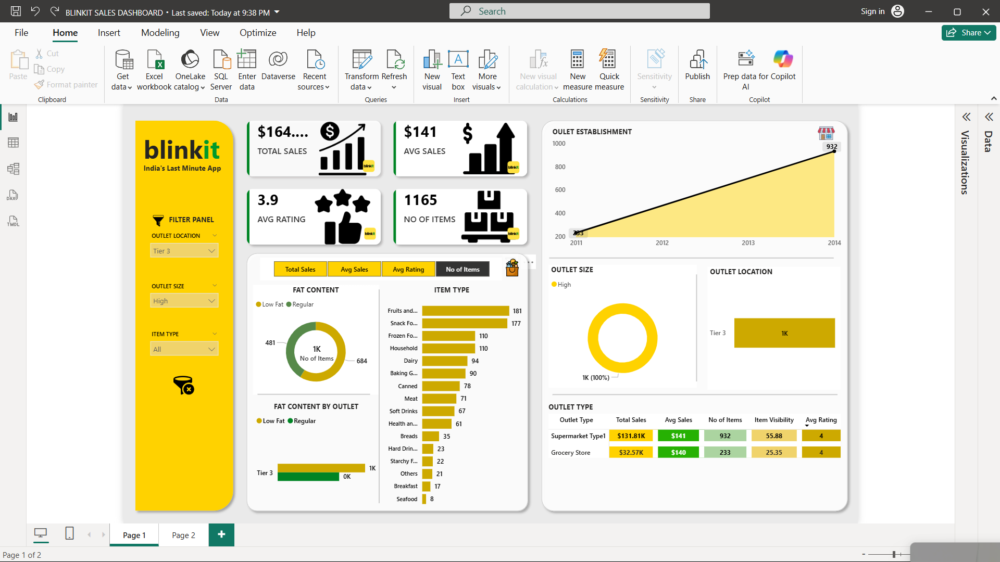

# 🛒 Blinkit Sales Analysis Dashboard | Power BI

This project features an **interactive Power BI dashboard** designed to analyze Blinkit’s sales performance and customer trends in the Quick Commerce domain.

The dashboard converts raw grocery sales data into **clear, actionable insights**.

---

## 📸 Dashboard Preview

---

## 🚀 Project Overview
Quick Commerce platforms like Blinkit have transformed urban shopping behavior.
This dashboard helps answer important business questions such as:

- How do sales vary across outlet sizes and locations?
- What is the impact of outlet establishment year on sales?
- Which product categories and fat content types perform better?
- How do customer ratings influence performance?

---

## 📊 Key Metrics
- Total Sales
- Average Sales
- Number of Items Sold
- Average Customer Rating

---

## 📈 Dashboard Visualizations
- **Donut Charts**: Item fat content & outlet size distribution  
- **Bar Charts**: Sales by item type and outlet type  
- **Funnel Chart**: Sales by outlet location tier  
- **Line Chart**: Sales trends by outlet establishment year  

---

## 🎛 Filters & Interactivity
Interactive filters allow users to drill down by:
- Outlet Type
- Location Tier
- Item Category
- Rating

This enables focused and custom analysis.

---

## 🛠 Tools & Technologies
- Power BI Desktop  
- Power Query  
- DAX  
- Excel Dataset  

---

## 💡 Insights Gained
- Outlet size and location significantly affect sales
- Customer preferences vary by item category
- Older outlets show different sales patterns than newer ones
- Tier-based analysis highlights high-performing regions

---

## ▶️ How to Use
1. Download Power BI Desktop  
2. Clone or download this repository  
3. Open `BLINKIT SALES DASHBOARD.pbix`  
4. Refresh data if required  
5. Explore insights using filters and visuals  

---

## 👤 Author
**Tejas Pathak**  
GitHub: https://github.com/tejas-0-5  

---

⭐ If you like this project, feel free to star the repository!
